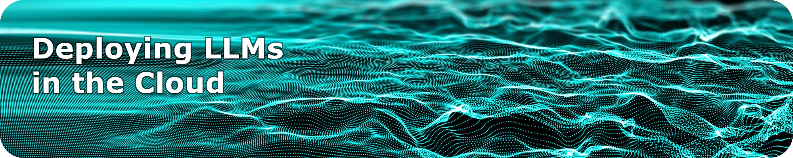

 <b>Summer School</b> ⬤ <b> de.NBI Cloud</b> ⬤ <b> Large Language Models</b> ⬤ <b> 16-20 September 2024</b> ⬤ <b> Online</b> 

  <b><a href="https://www.denbi.de/training">>> Register here <<</a></b>

### About

Ever wanted to look behind the - technical and organisational - scenes of Large Language Models? Already having your own AI reseach project sketched out but unsure of how to actually get started? Looking for cloud storage to power up your LLM but getting stuck in regulatory demands?

This summer school will provide practical answers by working through your own hands-on LLM example in the [de.NBI cloud](https://www.denbi.de/cloud). It is part of the de.KCD project which aims to to systemize and share the unique competence and knowledge from the de.NBI community - e.g. in difficult topics such as handling of sensitive data - across different sites and disciplines. Instead of struggling through the steps alone and reinventing the AI wheel over and over again we want to bring our joint expertise together providing you with a common, tried and tested workflow for cutting edge research.

In the course of the week we will give you a thourough walk through a complete life-cycle of LLM deployment in the cloud.  We will dive into the individual stages of the „day zero one two operation“ concept of software engineering - where day 0 is the planning and design phase (including setting up your cloud access and sketching your datamanagement plan); day 1 is go-live (installing and deploying your LLM); and day 2 is continuous operations (including backups and user authentification) and everything else that comes after going live — in our best case scenario, the never-ending day. 

### Educators

- **Dr. Sebastian Lobentanzer:** Uni Heidelberg - Biomedical researcher and developer of [BioChatter](https://biochatter.org/)
- **Prof. Dr. Fabian Praßer:** Berlin Institute of Health @ Charite - Head of [Medical Informatics Group](https://www.bihealth.org/en/research/research-group/prasser-lab-medical-informatics)
- **Martin Braun:** Berlin Institute of Health @ Charite - Developer at the [Research Group Cloud & IT](https://www.hidih.org/research/health-data)
- **Jakob Mathis:** Berlin Institute of Health @ Charite - Sytems Administrator at [Research Group Cloud & IT](https://www.hidih.org/research/health-data)

### Participants

**Target audience:** Everyone interested in digging into the technical and organisational details of deploying Large Language Models for research via cloud infrastructure. Our educators are mainly from a biomedical and IT background. However, we are looking forward to interdisciplinary exchange with research-developers and developer-researcher from all kinds of academic disciplines.

**Prerequisites:**  For following the practical exercises, you will need at least basic terminal knowledge (Linux/OSX Terminal). Technical affinity and previous coding experience will help you on your way. We will provide detailed written step-by-step instructions for everyone throughout and after the workshop. 

**Learning goals:** Participants will deploy their own LLM model in the de.NBI cloud by a step-by-step guided journey through a complete lifecycle from design (Day 0) via deployment (Day 1) to productive operation (Day 2).

### Content

- **Day 1:** How to Cloud - Introduction, de.NBI Cloud & Project Idea  
    
- **Day 2:**  How to Data - Data Management, Data Protection & Data Ethics  
  
- **Day 3:** How to LLM - Installation & Deployment of a Large Language Model 
    
- **Day 4:** How to Service  - Ensuring Continous Support throughout Operation  
  
- **Day 5:** How to Success -  Real Life Examples, Q&A and Discussion  

  
### Organisational details

**Dates:** Monday 16th - Friday 20th September 2024 

**Duration:** Daily, ca. 4h including breaks

**Location:** Online via Microsoft Teams

**Contact:** For more information email Lisa Schaak, [lisa.schaak@bih-charite.de](mailto:lisa.schaak@bih-charite.de)

**Registration:** Please register via [this webform](https://www.denbi.de/helpdesk?option=com_rsform&view=rsform&formId=7) by Monday 9th September 2024.

**Costs:** Registration for the [de.KCD](https://datenkompetenz.cloud/) Summer School is free of charge. 

### Code of Conduct
As de.NBI partners we are part of the German Node of ELIXIR. We therefore commit to the [ELIXIR Germany Code of Conduct](https://www.denbi.de/code-of-conduct) aiming to ensure all participants at our events can interact with each other in a respectful and safe environment, and have avenues to turn to in case they believe there has been a breach to this Code of Conduct.

*We will continue to update this website until the start of the Summer School - Stay tuned!*