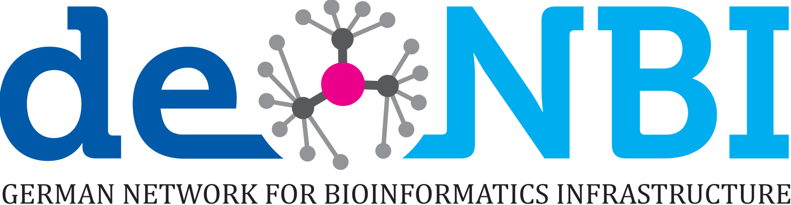

The Summer School will take place from **Monday 16th September - Friday 20th September 2024**. Below you'll find a preliminary agenda.

**[Join everyday via Teams](https://teams.microsoft.com/l/meetup-join/19%3ameeting_YjNkYWY3N2ItOGQ1ZS00MjI4LTk5MjYtOTQ1N2U3ZGQ3ZmI0%40thread.v2/0?context=%7b%22Tid%22%3a%22afe91939-923e-432c-bc66-cbc3ec18d02c%22%2c%22Oid%22%3a%22162bbf8b-ea15-4a0e-899a-cc6f68987ed6%22%7d)**

### Day 1: Monday 16th September 2024

* **How to Cloud** -  Introduction, de.NBI Cloud & Project Idea
  
Getting to know the de.NBI Cloud and each other - celebrating interdisciplinary and technological progress. Dive into access, roles and requirements and learn more about the project idea. 

 - de.NBI cloud
  
### Day 2: Tuesday 17th September 2024

* **How to Data** - Data Management, Data Protection & Data Ethics 
  
To be actually able to let the data work for us, we will have to work for the data: sketch a data management plan, record all processing activities GDPR-wise, ensuring IT-security and ethically sound and unbiased FAIR data.

  
### Day 3: Wednesday 18th September 2024

* **How to LLM** - Installation & Deployment of the Large Language Model 
  
Now we are finally ready for the long awaited action: Today we will deploy our own LLM in the de.NBI cloud. Learn all the practical in and outs of generative AI and transformer architecture. And see if all our previous days' planning efforts come to fruition.

 - BioChatter / BioCypher

### Day 4: Thursday 19th September 2024

* **How to Service**  - Ensuring continous support throughout operation  
  
We are live - but for how long? Today we will once again look dive into technical details - such as Lets encrypt certificates, Reverseproxy, User Authentification and Backup - which are fundamental to keep our service up and running.
  
### Day 5: Friday 20th September 2024

*  **How to Sucess** -  Real Life Examples, Q&A and Discussion 
   
You've made it! Today we will wrap up our week's work: We will reserve some time for self-study and Q&A to complete your hands-on examples. And we will look at some real life examples, and discuss their sucesses and challenges.
  
 - Recommended Reading